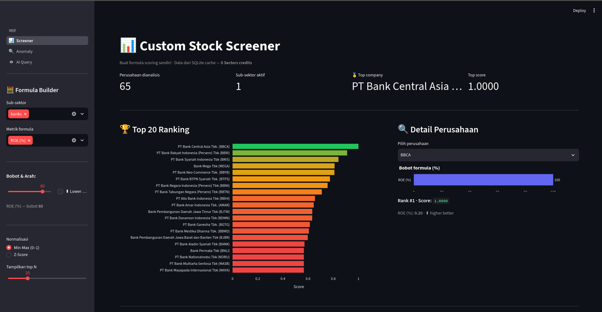
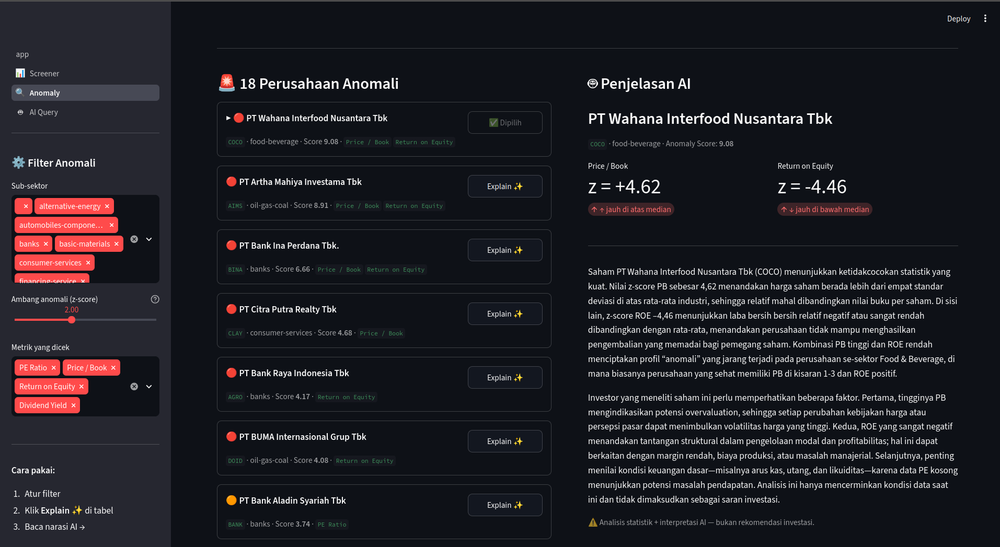
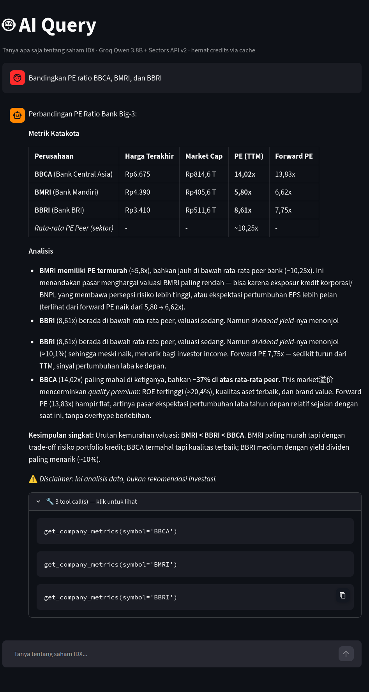

# IDX Insight Engine 🇮🇩📊


> Analisis saham IDX yang cerdas — screener kustom, deteksi anomali statistik, dan AI agent berbahasa alami dalam satu platform.

---

## Tentang Proyek

**IDX Insight Engine** adalah aplikasi analisis pasar saham Indonesia (IDX/BEI) yang dibangun untuk [Hackathon Sectors.app](https://hackathon.sectors.app) — Track 03: Market Intelligence.

Aplikasi ini menggabungkan tiga pendekatan analisis yang saling melengkapi:

| Fitur | Deskripsi |
|---|---|
| 📊 **Custom Screener** | Buat formula scoring sendiri dengan metrik PE, ROE, PB, dividend yield, dan bobot yang bisa disesuaikan |
| 🔍 **Anomaly Dashboard** | Deteksi saham yang berperilaku statistik berbeda dari median peer sub-sektornya menggunakan z-score |
| 🤖 **AI Query** | Tanya apa saja tentang saham IDX dalam Bahasa Indonesia — agent memilih tools secara otonom |

## Fitur Unggulan: Explainable Anomaly ★

Anomaly detection biasa hanya memberi tahu *bahwa* suatu saham anomali.
IDX Insight Engine melangkah lebih jauh — AI menjelaskan *mengapa*.

**Alur kerja:**
1. Z-score dihitung untuk setiap saham vs. median peer sub-sektornya
2. Saham dengan |z-score| > 2.0 di-flag sebagai anomali
3. Klik **Explain ✨** → AI (Groq) menerima data anomali + konteks finansial
4. AI menghasilkan narasi 2 paragraf: penyebab statistik + interpretasi fundamental

**Contoh output:**
> *"BBCA menunjukkan PE ratio 25.6x — 2.3 standar deviasi di atas median sub-sektor banks
> (18.4x). Hal ini mencerminkan premium valuasi yang konsisten dibayarkan investor untuk
> kualitas aset defensif dan dominasi CASA perseroan..."*

Ini adalah **derived insight** — bukan sekadar menampilkan data mentah,
melainkan interpretasi yang membutuhkan konteks lintas-metrik.

### Mengapa Sectors API?

Seluruh data finansial bersumber dari **Sectors REST API v2** — bukan sekadar dekoratif. Jika API key Sectors dihapus dan cache dikosongkan, seluruh fungsi utama aplikasi lumpuh:
- Screener tidak bisa menampilkan metrik (PE, ROE, PB, dll.)
- Anomaly detection tidak punya data untuk dianalisis
- AI agent tidak bisa menjawab query finansial

**Contoh dependensi nyata**: Jika hanya data PE yang tersedia (tanpa ROE dari Sectors),
anomaly detection degrades dari 4-metrik ke 2-metrik — kehilangan kemampuan deteksi
anomali profitabilitas yang justru paling relevan untuk investor.

---

## Tampilan Aplikasi

### Screener


### Anomaly Dashboard


### AI Query


---

## Arsitektur

```
User Query (Bahasa Indonesia)
        ↓
   Groq AI Agent (Qwen)
        ↓
  ┌─────┴──────┐
  │  4 Tools   │
  │ ─────────  │
  │ company    │
  │ metrics    │──→ SQLite Cache ──→ Sectors API v2
  │ sector     │     (data/cache.db)   (lazy fetch)
  │ companies  │
  │ top by     │
  │ metric     │
  │ subsector  │
  │ summary    │
  └────────────┘
        ↓
  Analisis + Tabel Markdown
```

**Stack:**

| Komponen | Teknologi |
|---|---|
| UI | Streamlit (multi-page) |
| AI Agent | Groq API — `qwen/qwen3.8-27b` |
| AI Explainer | Groq API — `openai/gpt-oss-20b` |
| Data | Sectors Financial API v2 |
| Cache | SQLite (`data/cache.db`) |
| Analitik | Pandas, NumPy, SciPy (z-score) |
| Visualisasi | Plotly |

---

## Instalasi & Menjalankan

### 1. Clone dan install dependencies

```bash
git clone https://github.com/Steven-Tampubolon/idx-insight-engine
cd idx-insight-engine
pip install -r requirements.txt
```

### 2. Konfigurasi API keys

```bash
# Salin file contoh
cp .env.example .env
cp .streamlit/secrets.toml.example .streamlit/secrets.toml

# Edit kedua file dan isi API keys:
# SECTORS_API_KEY = "your_sectors_api_key"
# GROQ_API_KEY    = "your_groq_api_key"
```

Dapatkan API key di:
- Sectors: [sectors.app](https://sectors.app)
- Groq: [console.groq.com](https://console.groq.com)

### 3. Inisialisasi data cache

```bash
python -m data.init_cache
```

Proses ini mengambil data dari Sectors API (~25 credits) dan menyimpannya ke `data/cache.db`. Cukup dijalankan **sekali** sebelum pertama kali menggunakan app.

### 4. Jalankan aplikasi

```bash
streamlit run app.py
```

Buka browser di `http://localhost:8501`.

---

## Panduan Penggunaan

### 📊 Custom Stock Screener

1. Pilih **sub-sektor** yang ingin dianalisis di sidebar (banks, coal, telecom, dll.)
2. Pilih **metrik formula** — bisa kombinasi PE, ROE, PB, dividend yield, market cap
3. Atur **bobot (weight)** sesuai strategi investasi Anda
4. Toggle **"⬇ Lower better"** untuk metrik seperti PE (semakin rendah semakin murah)
5. Lihat **ranking perusahaan** berdasarkan formula kustom Anda

### 🔍 Anomaly Dashboard

1. Atur **threshold z-score** di sidebar (default: 2.0 — artinya 2 standar deviasi dari median)
2. Pilih **metrik** yang ingin dicek anomalinya (PE Ratio, Price/Book, ROE, Dividend Yield)
3. Klik **Explain ✨** pada perusahaan anomali untuk mendapat narasi penjelasan dari AI
4. Narasi menjelaskan *mengapa* perusahaan ini anomali vs. peer sub-sektornya

> **Catatan**: Anomali bukan berarti buruk. PE sangat tinggi bisa berarti growth stock; PE sangat rendah bisa berarti value trap atau undervalued.

### 🤖 AI Query

1. Ketik pertanyaan dalam **Bahasa Indonesia** di kolom chat
2. Atau klik salah satu **suggested query** yang tersedia
3. Agent secara otonom memilih dan memanggil tools yang relevan
4. Lihat **"tool call log"** di expander untuk transparansi reasoning agent
5. Semua data diambil dari SQLite cache — **0 Sectors credits** saat runtime

**Contoh query yang didukung:**
- *"Bandingkan PE ratio BBCA, BMRI, dan BBRI"*
- *"Sub-sektor mana yang rata-rata PB-nya paling murah?"*
- *"Tampilkan 5 saham dengan market cap terbesar di IDX"*
- *"Saham sektor banks mana yang forward PE-nya paling rendah?"*

---

## Struktur Proyek

```
idx-insight-engine/
├── app.py                        # Entry point Streamlit
├── core/
│   ├── agent.py                  # Groq agentic loop + 4 tools
│   ├── anomaly.py                # Z-score anomaly detection per sub-sektor
│   ├── explainer.py              # AI narasi anomali (Groq)
│   └── screener.py               # Formula scoring engine
├── data/
│   ├── fetcher.py                # Sectors API v2 client + SQLite cache
│   └── init_cache.py             # One-time data initialization script
├── pages/
│   ├── 1_📊_Screener.py          # Screener UI
│   ├── 2_🔍_Anomaly.py           # Anomaly Dashboard UI
│   └── 3_🤖_AI_Query.py          # AI Chat UI
├── dev/
│   ├── check_groq.py             # Cek model Groq yang tersedia
│   └── test_logic.py             # Test get_company_details() langsung
├── docs/
│   └── specification.md          # Spesifikasi teknis
├── .env.example                  # Template environment variables
├── .streamlit/
│   └── secrets.toml.example      # Template Streamlit secrets
└── requirements.txt
```

---

## Desain Teknis

### Strategi Cache (Hemat API Credits)

```
init_cache (jalankan sekali):
  GET /v2/subsectors/              →  1 credit
  GET /v2/companies/ per subsector →  ~20 credits
  GET /v2/company/report/{sym}/    →  ~150 credits
  Total: ~171 credits

Runtime (0 credits):
  Screener  → SQLite only
  Anomaly   → SQLite only
  AI Query  → SQLite (lazy fetch ke API hanya jika symbol baru)
```

### Agentic Tool Calling

Agent menggunakan **manual tool-calling loop** dengan Groq API — bukan automatic function calling — untuk kontrol penuh atas iterasi dan error handling:

```python
while True:
    response = groq.chat(messages, tools)
    if not response.tool_calls:
        break  # selesai
    # eksekusi tools, append hasil, lanjut loop
```

### Z-Score Anomaly Detection

Anomali dihitung **per sub-sektor**, bukan secara global, agar perbandingan adil:

```python
# Untuk setiap metrik dan sub-sektor:
z_score = (nilai_perusahaan - median_subsector) / MAD_subsector
# Flagged sebagai anomali jika |z_score| > threshold (default: 2.0)
```

---

## Catatan

- **Offline-first**: Setelah cache diisi, Screener dan Anomaly berjalan tanpa koneksi internet
- **Tidak ada eksekusi transaksi**: Aplikasi hanya menganalisis dan memberi insight, tidak menempatkan order beli/jual
- **Bukan rekomendasi investasi**: Semua output adalah analisis data untuk tujuan edukasi

---

## Dibuat untuk

[Hackathon Sectors.app](https://hackathon.sectors.app) — Track 03: Market Intelligence
September 2026
